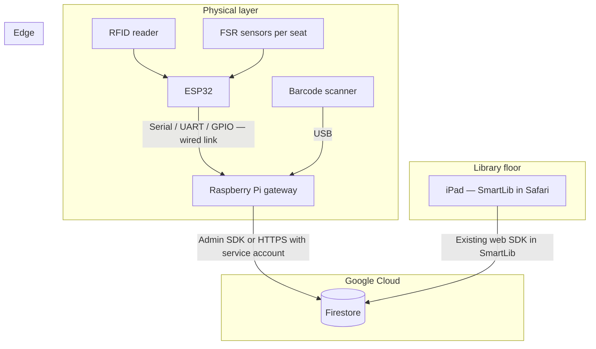
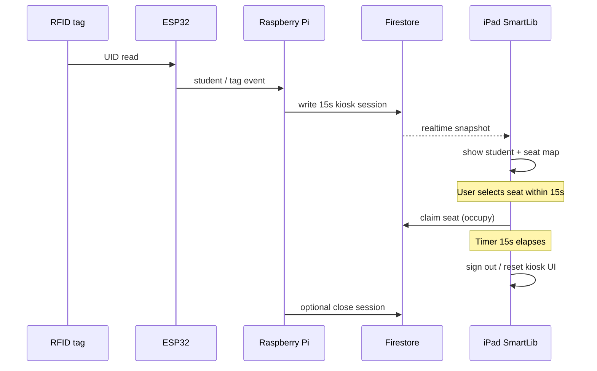
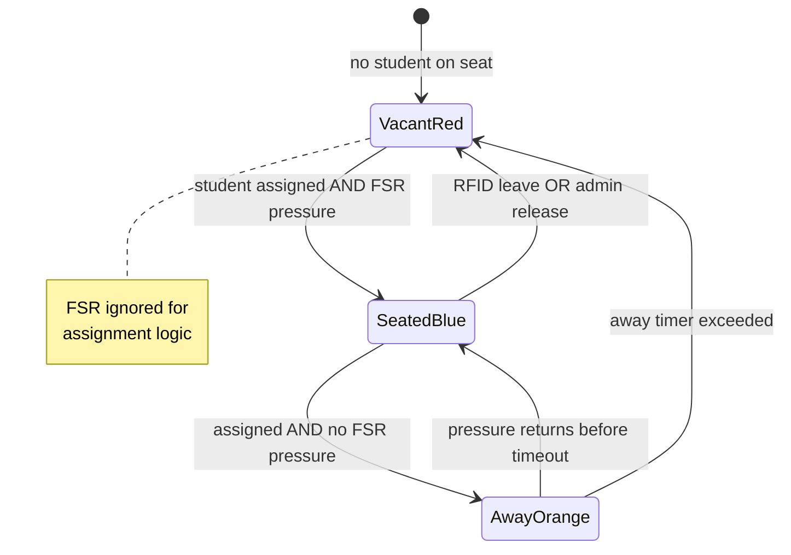
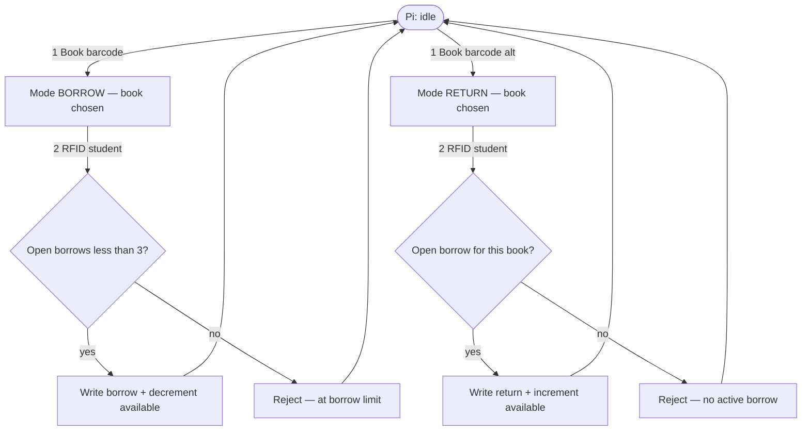
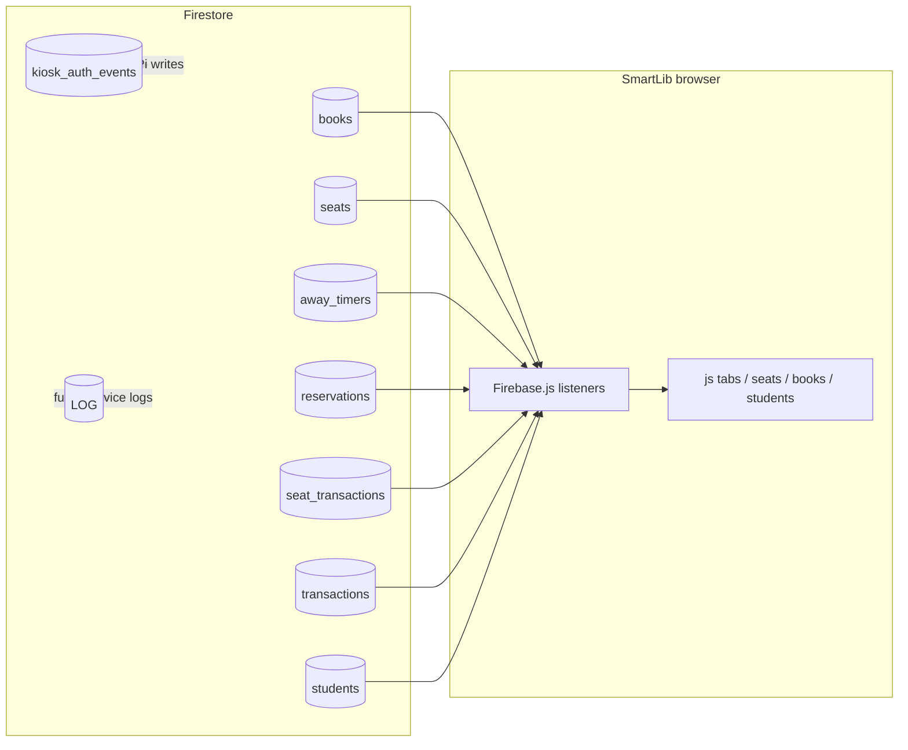

# SmartLib

Static web app for **library management**: student sign-in, seat map with reservations and away timers, book catalog and borrowing, and a staff dashboard. All live data comes from **Cloud Firestore** via `Firebase.js` (real-time listeners).

**Run locally over HTTP** (see below). Opening `index.html` as a `file://` URL can break the Firebase ES module.

---

## Physical system architecture and hardware specification

This section describes the **target end-to-end system** you are building: **ESP32** (RFID + FSR) connected by **cables** to a **Raspberry Pi**, a **USB barcode scanner** on the Pi, the Pi as the **only edge device** that writes to **Firebase / Firestore**, and the **SmartLib dashboard on an iPad (iOS Safari)** that stays in sync through the same Firestore project as the web app.

### Component layout



| Component | How it connects | Role |
|-----------|-----------------|------|
| **ESP32** | Wired data link to Pi | Read RFID tags and FSR channels; send framed events to the Pi (timing and thresholds can be split between firmware and Pi). |
| **RFID** | Typically wired to ESP32 | Produce a tag UID; Pi or ESP firmware maps UID → **`students.id`** (`###-####`) stored in Firestore. |
| **FSR** | One sensor (or zone) per physical seat | Indicates **pressure present** vs **no pressure** for that seat only. |
| **Barcode scanner** | **USB** to Raspberry Pi | Acts as a keyboard wedge; Pi captures **book barcode** lines (must match `books.barcode`). |
| **Raspberry Pi** | Ethernet / Wi‑Fi | Single trusted writer: debounce, state machines, borrow-limit checks, Firestore updates. |
| **iPad** | Wi‑Fi | Displays SmartLib; reflects Firestore in near real time after Pi writes. |

**Design principle:** Keep Firebase credentials and TLS on the **Pi**, not on the ESP32, unless you later add a separate secure path.

---

### RFID — kiosk session, seat choice, and leaving

#### A. Auto “login” for 15 seconds (seat selection window)

**Goal:** When a student scans their **RFID**, the account for that id becomes active on the **iPad** so they can **pick a seat** without typing email and password. After **15 seconds**, the session ends and the user is **signed out** (or returned to a neutral kiosk screen).

| Element | Recommended approach |
|---------|------------------------|
| Identity | Pi maps tag UID → Firestore **`students`** document (`id` / email / name as needed). |
| Session signal | Pi writes a **short-lived** record (e.g. `kiosk_sessions/{id}` or append-only `kiosk_auth_events` with `action: "rfid_login"`, `student_id`, `expiresAt` timestamp). |
| iPad behavior | **Requires app changes:** add a **kiosk / RFID mode** that listens for that document (or a dedicated Cloud Function channel) and mirrors **manual sign-in** (`currentUser`, **My Seat** tab) for **15 seconds**, then clears session locally and optionally marks the Firestore session consumed. |
| Seat claim | Student taps a seat on the iPad within 15s → same writes as today: **`seats`** (`occupied`, `studentId`) + **`seat_transactions`** (`sit`), etc. |



#### B. Leaving the library / freeing the seat with RFID

**Goal:** If the student is **about to leave**, they scan their **RFID** again; their **seat becomes available** automatically (no need to press “I’m leaving” on the UI if the Pi owns this flow).

**Suggested Firestore effect:**

1. Resolve student from RFID.
2. Find their assigned **`seats`** row (`studentId` match, `occupied: true`).
3. Clear any active **`away_timers`** for that `(seatId, studentId)`.
4. Set seat **`occupied: false`**, **`studentId: null`** (and clear any hardware-only fields such as `state` / `fsrRaw` if you use them for logic).
5. Append **`seat_transactions`** with a clear `type` (e.g. `leave` or a dedicated `rfid_release` if you extend the schema consistently).

The iPad map updates on the next listener tick.

---

### FSR — how pressure maps to seat color (only when seat is assigned)

**Vacant seats (not taken by any user):** show **red** in your target UX. The **FSR does not change** the vacant state; ignore or filter FSR for unassigned seats so noise does not flip availability.

**Assigned seat (`occupied: true`, `studentId` set):**

| FSR reading | Meaning | Target seat display | Backend behavior |
|-------------|---------|----------------------|------------------|
| **No pressure** (below threshold, debounced) | Nobody on the chair | **Away** (warning / orange) + **away timer** | Create or maintain **`away_timers`** with `active: true` and `expiresAt` per policy. |
| Timer **exceeded** while still no pressure | Absence too long | **Available** again (red vacant) | End timer (`active: false`), clear **`seats`** assignment, log **`seat_transactions`** (align with your “collect” semantics). |
| **Pressure present** | Person sitting | **Blue** (seated) | Clear conflicting away state for that seat/student; keep **`occupied: true`** and same **`studentId`**; optional `fsrRaw` / `state: "seated"` for telemetry. |



**Implementation note:** Use **hysteresis** (different thresholds for press vs release) and a **time debounce** so small bumps do not oscillate between blue and away.

---

### Barcode — borrow and return (order matters)

The scanner is **USB on the Raspberry Pi**. The Pi must run a **small state machine** so the meaning of each scan is unambiguous.

#### Borrow a book

1. **First scan:** **book barcode** (declares intent: “I want to borrow”).
2. **Second scan:** **RFID** → student id.

Then the Pi:

- Resolves book by **`books.barcode`**.
- Counts **active borrows** for that student (same rule as the web app: a `borrow` without a later `return` for the same `book_id` / `student_uid`).
- If count **≥ `MAX_ACTIVE_BORROWS` (3)** in `Firebase.js`, **do not** create a borrow; optionally log rejection to `LOG` or `kiosk_auth_events`.
- If under limit: add **`transactions`** (`type: "borrow"`, `dueDate`, …) and update **`books.available`** / **`status`** like `studentBorrowBook` in `Firebase.js`.

#### Return a book

Same **scan order** as borrow:

1. **First scan:** **book barcode**.
2. **Second scan:** **RFID** → student id.

Then the Pi:

- Verifies the student has an **open borrow** for that book.
- If yes: append **`transactions`** (`type: "return"`) and restore **`books.available`** (mirror `studentReturnBook` logic).
- If no matching borrow: **reject** and do not mutate inventory.



**Optional:** distinguish **borrow** vs **return** first step with a **dedicated RFID “mode” tag**, a **GPIO button** (“Borrow” / “Return”), or a **timeout** between scans if you find accidental mis-routing in the field.

---

### Implementation checklist

- [ ] Pi: stable serial protocol from ESP32 (frame: seat index, FSR value, RFID UID, CRC if needed).
- [ ] Pi: USB HID barcode capture (newline-terminated strings).
- [ ] Pi: RFID UID ↔ `students.id` table (Firestore or local cache from `students`).
- [ ] Pi: FSR calibration per seat (thresholds + hysteresis + debounce ms).
- [ ] Firestore: service account on Pi; tight security rules for kiosk collections.
- [x] iPad SmartLib: **kiosk mode** — login screen **Library kiosk (RFID)** or URL **`?kiosk=1`** listens for **`kiosk_auth_events`** (`action: rfid_scan`); short session then auto sign-out (see **`js/kiosk.js`**, **`Firebase.js`**). Firestore must **allow client read** on that collection (see **`hardware/pi/FIRESTORE-LAB.md`**).
- [ ] QA: borrow limit 3, 4th borrow rejected; return path; RFID release; FSR blue ↔ away ↔ timeout ↔ red.

---

## How the dashboard uses Firestore

1. **Startup:** After login, `auth.js` calls `window._startFirebaseListeners()` once. That registers `onSnapshot` listeners in `Firebase.js`.
2. **In memory:** Each listener rebuilds a global array (`window.books`, `window.seats`, `window.transactions`, `window.seatTransactions`, `window.reservations`, `window.awayTimers`, `window.students`) and assigns the same references to the legacy globals (`books`, `seats`, etc.) initialized in `js/state.js`.
3. **UI refresh:** Most listeners call `window.renderTab()` (books/transactions refresh broadly; seats-related listeners only refresh when the **Seats** staff tab or **My Seat** student tab is active, to limit churn). `seat_transactions` also triggers `rebuildHourlyDataFromSeatTransactions()` for busiest-hour bars.
4. **Writes:** User actions call helpers on `window` (`occupySeatByStudent`, `startAwayTimer`, `studentBorrowBook`, …) which `updateDoc` / `addDoc` / `setDoc` / `runTransaction` on Firestore. The next snapshot then updates the UI.

There is **no** custom backend: the browser talks to Firestore directly. A Raspberry Pi gateway would use the **Admin SDK** or **REST** with a service account, or device auth you configure in rules.

---

## Firestore collections (schema reference)

Below matches what appears in your console and what **`Firebase.js`** reads or writes. Field types reflect current usage (many timestamps are **strings** or **numbers** in ms, not Firestore `Timestamp`).

### `students` (used)

| Field | Purpose |
|--------|---------|
| Document ID | Same as student `id` (e.g. `241-7504`) when created via app |
| `id` | Student ID string |
| `name`, `email`, `password` | Profile and demo auth (see Security note) |
| `institution` | `MEDTECH` or `MSB` |
| `department` | MedTech departments; MSB may use `""` |
| `status` | `active`, `banned`, etc. (staff can ban) |

**Dashboard:** Staff **Students** tab lists `window.students`. Presence (**In library / Away / Not here**) is derived in `js/students.js` from **`seats`** + **`away_timers`**, not from a `presence` field on the student doc.

### `books` (used)

| Field | Purpose |
|--------|---------|
| `id` | Human-readable id (e.g. `BK-002`) assigned by app |
| `barcode` | Unique; used for checkout / hardware barcode workflows |
| `title`, `author`, `category` | Catalog |
| `qty`, `available` | Inventory counts |
| `status` | e.g. `available`, `checked-out`, `missing` |

**Dashboard:** Staff books CRUD; students browse and borrow against `barcode` / `id`.

### `transactions` (used — book borrows / returns)

| Field | Purpose |
|--------|---------|
| `student_uid` | Student id |
| `book_id`, `book_title` | Book reference |
| `type` | `borrow` or `return` |
| `timestamp` | String (locale-style in some flows; dashboard compares with `Date`) |
| `dueDate` | ISO date string on borrow; `null` on return |

**Dashboard:** Staff transactions view, student “my borrows” (pairs borrow/return by time).

### `seats` (used)

| Field | Purpose |
|--------|---------|
| Document ID | Often equals logical `id` (e.g. `seat_1`, `S003`); may differ — app keeps `firebaseId` from snapshot |
| `id` | Seat label shown on map |
| `type` | Seat type (Regular, Quiet Zone, …) |
| `occupied` | **Boolean** — primary source of truth for “someone is assigned here” |
| `studentId` | Assigned student id, or `null` |

**Optional / legacy / hardware (in your DB but not required by the web UI):** e.g. `state` (`"away"` …), `fsrRaw`, `student_id`, `updatedAt`. The current dashboard logic keys off **`occupied`**, **`studentId`**, **`away_timers`**, and **`reservations`**. If the Pi writes only `state` or `student_id`, keep **`occupied` / `studentId`** in sync to avoid the map and `startAwayTimer` checks disagreeing with hardware.

### `away_timers` (used)

| Field | Purpose |
|--------|---------|
| `active` | `true` while countdown running; set `false` when cleared |
| `seatId`, `studentId` | Who is away from which seat |
| `startedAt`, `expiresAt` | Numbers (ms) when created via app |
| `endedAt`, `reason` | Set when timer ends (`return`, `collect`, …) |

**Listener:** Only documents with `active === true` are pushed into `window.awayTimers`.

**Dashboard:** Student “away” UI, staff timers, seat “away lock”, presence **Away**.

### `reservations` (used)

| Field | Purpose |
|--------|---------|
| `active` | Reservation live or ended |
| `seatId`, `studentId`, `studentName` | Target seat and student |
| `expiresAt` | ms since epoch |
| `durationSeconds`, `createdAt` | Metadata |
| `cancelledAt`, `reason` | When cancelled / expired / claimed |

**Dashboard:** Student reserve / claim; staff seat view.

### `reservation_slots` (used)

Top-level docs keyed by **`seatId`** (not a subcollection). Used inside `runTransaction` when creating a reservation to avoid double booking. The web app creates/deletes these alongside `reservations`.

### `seat_transactions` (used — audit / analytics)

| Field | Purpose |
|--------|---------|
| `seatId`, `studentId` | May be `null` for some admin events |
| `type` | `sit`, `leave`, `return`, `collect`, `reserve`, `cancel`, `claim`, `expire`, `delete`, … |
| `timestamp` | ISO string from app |

**Dashboard:** Busiest hours (`js/seats.js` → `rebuildHourlyDataFromSeatTransactions` counts `sit` / `return` for “today”).

**Note:** Student **“I’m leaving”** logs `leave` via `addSeatTransaction` but **does not** call `releaseSeatByStudent`; the seat stays **`occupied: true`** until return/collect. Design aligns with away behavior.

### `kiosk_auth_events` (present in your project; **not** read by `Firebase.js`)

Example shape from your data: `action` (e.g. `leave`), `student_id`, `student_name`, `timestamp`.

**Use case:** Ideal target for **Raspberry Pi / kiosk** append-only logs when a physical reader or gate identifies a student. Extend the web app with another listener if you want live kiosk status on the dashboard.

### `LOG` (present; **not** read by `Firebase.js`)

Use for device diagnostics, MQTT bridge logs, or ESP32 heartbeat. Wire a listener later if needed.

---

## Data flow summary (mermaid)



---

## Tech stack

- HTML, CSS, vanilla JavaScript  
- [Firebase JS SDK v10](https://firebase.google.com/docs/web/setup) (Firestore) via `Firebase.js` (ES module)

---

## Run locally

```bash
npx --yes serve .
# or: python -m http.server 8080
```

Then open the printed URL (e.g. `http://localhost:3000`).

---

## Security notes (production)

- Firestore rules must restrict reads/writes by role or auth.  
- **`students.password`** is stored in plaintext in the current demo flow — replace with Firebase Authentication or hashed passwords before production.  
- Web client API keys in `Firebase.js` are normal for browser apps; combine with **App Check**, domain restrictions, and strict rules.

---

## Repository layout

| Path | Role |
|------|------|
| `index.html` | Shell, login, tab host, script tags |
| `Firebase.js` | Firebase init, listeners, Firestore helpers |
| `style.css` | Global styles |
| `js/state.js` | Shared state and constants |
| `js/auth.js` | Student/staff auth, `_startFirebaseListeners` |
| `js/tabs.js` | Tab switching and main content rendering |
| `js/seats.js` | Seat map, away timer UI, hourly chart |
| `js/books.js`, `js/student-books.js` | Books and student borrowing |
| `js/students.js` | Staff student list / presence |
| `js/*.js` | Alerts, issues, transactions, utils |
| `partials/*.html` | HTML fragments for tabs |
| `hardware/README.md` | Pi + ESP32 phases (**PHASE0**, **PHASE1**), `hardware/pi/`, `hardware/esp32/` |

---

## Default staff login (demo)

`admin@smartlib.edu` / `admin123` — change or remove in production.

---

## Contributing

Issues and pull requests: [github.com/bousninayoussef2005-netizen/isss](https://github.com/bousninayoussef2005-netizen/isss).
