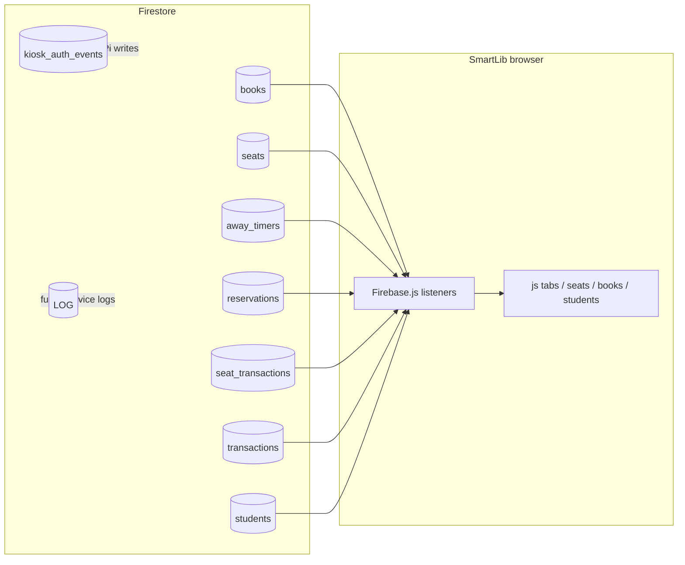

# SmartLib

Static web app for **library management**: student sign-in, seat map with reservations and away timers, book catalog and borrowing, and a staff dashboard. All live data comes from **Cloud Firestore** via `Firebase.js` (real-time listeners).

**Run locally over HTTP** (see below). Opening `index.html` as a `file://` URL can break the Firebase ES module.

---

## How the dashboard uses Firestore

1. **Startup:** After login, `auth.js` calls `window._startFirebaseListeners()` once. That registers `onSnapshot` listeners in `Firebase.js`.
2. **In memory:** Each listener rebuilds a global array (`window.books`, `window.seats`, `window.transactions`, `window.seatTransactions`, `window.reservations`, `window.awayTimers`, `window.students`) and assigns the same references to the legacy globals (`books`, `seats`, etc.) initialized in `js/state.js`.
3. **UI refresh:** Most listeners call `window.renderTab()` (books/transactions refresh broadly; seats-related listeners only refresh when the **Seats** staff tab or **My Seat** student tab is active, to limit churn). `seat_transactions` also triggers `rebuildHourlyDataFromSeatTransactions()` for busiest-hour bars.
4. **Writes:** User actions call helpers on `window` (`occupySeatByStudent`, `startAwayTimer`, `studentBorrowBook`, …) which `updateDoc` / `addDoc` / `setDoc` / `runTransaction` on Firestore. The next snapshot then updates the UI.

There is **no** custom backend: the browser talks to Firestore directly. A Raspberry Pi gateway would use the **Admin SDK** or **REST** with a service account, or device auth you configure in rules.

---

## Firestore collections (schema reference)

Below matches what appears in your console and what **`Firebase.js`** reads or writes. Field types reflect current usage (many timestamps are **strings** or **numbers** in ms, not Firestore `Timestamp`).

### `students` (used)

| Field | Purpose |
|--------|---------|
| Document ID | Same as student `id` (e.g. `241-7504`) when created via app |
| `id` | Student ID string |
| `name`, `email`, `password` | Profile and demo auth (see Security note) |
| `institution` | `MEDTECH` or `MSB` |
| `department` | MedTech departments; MSB may use `""` |
| `status` | `active`, `banned`, etc. (staff can ban) |

**Dashboard:** Staff **Students** tab lists `window.students`. Presence (**In library / Away / Not here**) is derived in `js/students.js` from **`seats`** + **`away_timers`**, not from a `presence` field on the student doc.

### `books` (used)

| Field | Purpose |
|--------|---------|
| `id` | Human-readable id (e.g. `BK-002`) assigned by app |
| `barcode` | Unique; used for checkout / hardware barcode workflows |
| `title`, `author`, `category` | Catalog |
| `qty`, `available` | Inventory counts |
| `status` | e.g. `available`, `checked-out`, `missing` |

**Dashboard:** Staff books CRUD; students browse and borrow against `barcode` / `id`.

### `transactions` (used — book borrows / returns)

| Field | Purpose |
|--------|---------|
| `student_uid` | Student id |
| `book_id`, `book_title` | Book reference |
| `type` | `borrow` or `return` |
| `timestamp` | String (locale-style in some flows; dashboard compares with `Date`) |
| `dueDate` | ISO date string on borrow; `null` on return |

**Dashboard:** Staff transactions view, student “my borrows” (pairs borrow/return by time).

### `seats` (used)

| Field | Purpose |
|--------|---------|
| Document ID | Often equals logical `id` (e.g. `seat_1`, `S003`); may differ — app keeps `firebaseId` from snapshot |
| `id` | Seat label shown on map |
| `type` | Seat type (Regular, Quiet Zone, …) |
| `occupied` | **Boolean** — primary source of truth for “someone is assigned here” |
| `studentId` | Assigned student id, or `null` |

**Optional / legacy / hardware (in your DB but not required by the web UI):** e.g. `state` (`"away"` …), `fsrRaw`, `student_id`, `updatedAt`. The current dashboard logic keys off **`occupied`**, **`studentId`**, **`away_timers`**, and **`reservations`**. If the Pi writes only `state` or `student_id`, keep **`occupied` / `studentId`** in sync to avoid the map and `startAwayTimer` checks disagreeing with hardware.

### `away_timers` (used)

| Field | Purpose |
|--------|---------|
| `active` | `true` while countdown running; set `false` when cleared |
| `seatId`, `studentId` | Who is away from which seat |
| `startedAt`, `expiresAt` | Numbers (ms) when created via app |
| `endedAt`, `reason` | Set when timer ends (`return`, `collect`, …) |

**Listener:** Only documents with `active === true` are pushed into `window.awayTimers`.

**Dashboard:** Student “away” UI, staff timers, seat “away lock”, presence **Away**.

### `reservations` (used)

| Field | Purpose |
|--------|---------|
| `active` | Reservation live or ended |
| `seatId`, `studentId`, `studentName` | Target seat and student |
| `expiresAt` | ms since epoch |
| `durationSeconds`, `createdAt` | Metadata |
| `cancelledAt`, `reason` | When cancelled / expired / claimed |

**Dashboard:** Student reserve / claim; staff seat view.

### `reservation_slots` (used)

Top-level docs keyed by **`seatId`** (not a subcollection). Used inside `runTransaction` when creating a reservation to avoid double booking. The web app creates/deletes these alongside `reservations`.

### `seat_transactions` (used — audit / analytics)

| Field | Purpose |
|--------|---------|
| `seatId`, `studentId` | May be `null` for some admin events |
| `type` | `sit`, `leave`, `return`, `collect`, `reserve`, `cancel`, `claim`, `expire`, `delete`, … |
| `timestamp` | ISO string from app |

**Dashboard:** Busiest hours (`js/seats.js` → `rebuildHourlyDataFromSeatTransactions` counts `sit` / `return` for “today”).

**Note:** Student **“I’m leaving”** logs `leave` via `addSeatTransaction` but **does not** call `releaseSeatByStudent`; the seat stays **`occupied: true`** until return/collect. Design aligns with away behavior.

### `kiosk_auth_events` (present in your project; **not** read by `Firebase.js`)

Example shape from your data: `action` (e.g. `leave`), `student_id`, `student_name`, `timestamp`.

**Use case:** Ideal target for **Raspberry Pi / kiosk** append-only logs when a physical reader or gate identifies a student. Extend the web app with another listener if you want live kiosk status on the dashboard.

### `LOG` (present; **not** read by `Firebase.js`)

Use for device diagnostics, MQTT bridge logs, or ESP32 heartbeat. Wire a listener later if needed.

---

## Data flow summary (mermaid)



---

## Hardware roadmap: ESP32 → Raspberry Pi → Firestore

1. **ESP32:** Read sensors (FSR, RFID, PIR, etc.) and send compact events to the Pi (UART, Wi‑Fi, MQTT).
2. **Raspberry Pi:** Debounce, map **physical seat / kiosk ID** → Firestore **`seatId`** / **`student_uid`**, enforce rules, then write using **Firebase Admin SDK** (Python/Node) or HTTPS Cloud Functions.
3. **Firestore:** Prefer the same fields the web app already uses so the dashboard updates with no HTML changes:
   - **Seat presence:** update `seats/{docId}` with `occupied`, `studentId`, and optionally `fsrRaw`, `updatedAt`, `state` for your own analytics.
   - **Temporary away:** create an **`away_timers`** doc with `active: true`, `expiresAt`, etc., or rely on the student pressing **I’m leaving** on the web — avoid conflicting dual writers unless you define precedence.
   - **Book checkout at a kiosk:** add **`transactions`** borrow rows and adjust **`books`** `available` / `status` similarly to `window.studentBorrowBook` in `Firebase.js`.
   - **Kiosk tap log:** append to **`kiosk_auth_events`** (already in your DB) for traceability without overloading `seat_transactions`.

4. **Security:** Use a **service account on the Pi**, not the public web API key. Lock Firestore rules so only the Pi (or Cloud Functions) can write hardware-driven fields.

5. **Consistency:** If legacy docs use both `studentId` and `student_id`, normalize on write so **`studentId`** always matches **`students/{id}`**.

---

## Tech stack

- HTML, CSS, vanilla JavaScript  
- [Firebase JS SDK v10](https://firebase.google.com/docs/web/setup) (Firestore) via `Firebase.js` (ES module)

---

## Run locally

```bash
npx --yes serve .
# or: python -m http.server 8080
```

Then open the printed URL (e.g. `http://localhost:3000`).

---

## Security notes (production)

- Firestore rules must restrict reads/writes by role or auth.  
- **`students.password`** is stored in plaintext in the current demo flow — replace with Firebase Authentication or hashed passwords before production.  
- Web client API keys in `Firebase.js` are normal for browser apps; combine with **App Check**, domain restrictions, and strict rules.

---

## Repository layout

| Path | Role |
|------|------|
| `index.html` | Shell, login, tab host, script tags |
| `Firebase.js` | Firebase init, listeners, Firestore helpers |
| `style.css` | Global styles |
| `js/state.js` | Shared state and constants |
| `js/auth.js` | Student/staff auth, `_startFirebaseListeners` |
| `js/tabs.js` | Tab switching and main content rendering |
| `js/seats.js` | Seat map, away timer UI, hourly chart |
| `js/books.js`, `js/student-books.js` | Books and student borrowing |
| `js/students.js` | Staff student list / presence |
| `js/*.js` | Alerts, issues, transactions, utils |
| `partials/*.html` | HTML fragments for tabs |

---

## Default staff login (demo)

`admin@smartlib.edu` / `admin123` — change or remove in production.

---

## Contributing

Issues and pull requests: [github.com/bousninayoussef2005-netizen/isss](https://github.com/bousninayoussef2005-netizen/isss).
